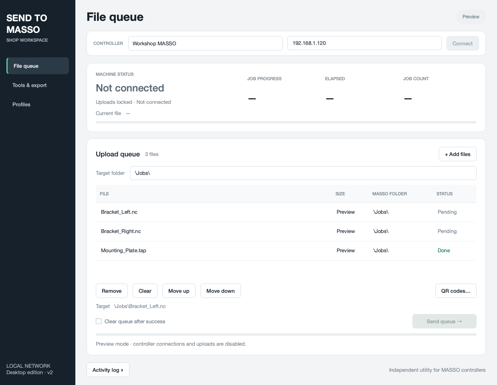

# Send-to-MASSO Manager

Send-to-MASSO Manager is an independent desktop utility for sending G-code files to a MASSO controller over the network. Version 2 uses a Qt interface with an upload queue, live machine status, connection profiles, QR-code export, and read-only tool-data export.

This project is not affiliated with or endorsed by MASSO. Its network protocol is based on packet captures and real-controller testing, rather than official MASSO documentation.

## Current status

**v2 is a preview release.** Automated protocol, queue, and desktop tests pass on macOS, and the packaged Mac app has been checked for startup. Real-controller verification of v2 and Windows testing remain outstanding.

The legacy v1.8.20 RC launcher has been retired. Its previous version remains in Git history, and its protocol fixes are retained in `masso_core.py`.



The screenshot shows sample files in **demo mode**. Normal startup begins with an empty queue.

## Run from source

Use Python **3.10 or newer**. Development testing used Python 3.12 on macOS. The app uses PySide6 and does not require Tkinter.

From the project folder on macOS or Linux:

```sh
python -m venv .venv
.venv/bin/python -m pip install -r requirements.txt
.venv/bin/python send_to_masso_v2.py
```

On Windows, use PowerShell:

```powershell
python -m venv .venv
.\.venv\Scripts\python.exe -m pip install -r requirements.txt
.\.venv\Scripts\python.exe send_to_masso_v2.py
```

To preview the interface with sample queue entries:

```sh
.venv/bin/python send_to_masso_v2.py --demo
```

On Windows, substitute `.\.venv\Scripts\python.exe` for `.venv/bin/python`. Demo mode disables controller connections and uploads, and does not save settings.

## Build or use a standalone app

Packaged apps include Python and their runtime dependencies. Build on macOS for a Mac `.app`, or on Windows for an `.exe`.

On macOS, after creating the virtual environment:

```sh
.venv/bin/python -m pip install -r requirements-build.txt
.venv/bin/python build_desktop.py
open "dist/Send-to-MASSO Manager.app"
```

You can copy the complete `.app` to Applications.

On Windows:

```powershell
.\.venv\Scripts\python.exe -m pip install -r requirements-build.txt
.\.venv\Scripts\python.exe build_desktop.py
```

Launch `dist\Send-to-MASSO Manager\Send-to-MASSO Manager.exe`. Keep the entire output folder, including `_internal`, together. If you receive it as a ZIP, extract it to a writable folder before launching.

For a single Windows executable, build with `build_desktop.py --onefile`.

See [Building desktop bundles](docs/BUILDING.md) for packaging, architecture, Mac signing, settings migration, and verification details.

## Connect to a controller

1. Ensure the computer and MASSO can reach each other on the network.
2. Open **Profiles**, click **New profile**, and enter a profile name and controller address.
3. Click **Save profile**.
4. Select the profile in the connection bar and click **Connect**.
5. Open **File queue** and wait for fresh machine status.

An IP address is the recommended starting point; resolvable hostnames are also supported. Disconnect before switching, editing, or deleting profiles.

## Send files

1. Set the **Target folder**, for example `\Jobs\`, `\Test\`, or `\` for the MASSO root. Forward slashes are accepted and normalized to backslashes.
2. Click **+ Add files**, or drag local files into the queue.
3. Review filenames, queue order, and the target-path preview.
4. Use **Move up** or **Move down** to reorder a selected file if needed.
5. When the controller is ready, click **Send queue →**.

Files upload one at a time. Uploading does not start machining. If an upload fails, the queue stops; check **Activity log**, resolve the cause, and send again to retry failed and pending files.

To create one combined program, combine and post it in Fusion using your Fusion plugin, then add the resulting file here. The app uploads already-posted files and has no merge function.

### Queue controls

| Control | Behavior |
| --- | --- |
| **+ Add files** | Adds local files; unavailable during an active queue run. |
| **Remove** | Removes selected queue entries. |
| **Clear** | Clears the queue when no upload is active. |
| **Move up / Move down** | Changes the selected file's position before sending. |
| **QR codes…** | Exports codes for selected entries, or the entire queue when none are selected. |
| **Clear queue after success** | Clears the queue after a successful run. |

Changing the target folder updates **Pending** and **Failed** entries. **Sending** and **Done** entries keep their original destinations. The queue is not saved between app launches.

### Upload readiness

Sending requires a connected, stopped controller with no fault or pending user prompt/tool change, plus machine status received within the last five seconds. Incoming packets must match the connected controller address.

The app checks readiness again between files and stops the queue if the controller becomes unavailable or unsafe for uploads. Missing or empty files and invalid target names also prevent sending.

## File types and names

Expected extensions are `.nc`, `.cnc`, `.tap`, `.eia`, and `.txt`. Other extensions produce a warning.

Use plain ASCII names, such as `Bracket Left.nc`, `part#12.tap`, or `CustomerPart_01.tap`. Non-ASCII names and invalid target characters are blocked. Avoid these characters in file and folder names:

```text
: * ? " < > |
```

## Export QR codes

1. Add files and set the correct target folder.
2. Select the entries you want to export. To export every queued entry, clear the selection.
3. Click **QR codes…** and choose an output folder.

The app creates one PNG per file, named `YourFileName_MASSO_QR.png`. QR codes refer to the MASSO target paths; the corresponding G-code files must exist at those paths on the controller. If files have identical names, select and export them separately to avoid filename collisions.

## Export tool data

Connect to the controller, open **Tools & export**, and click **Download tools**. Once the download finishes, click **Export text…** to save the list.

This feature reads slots 1–118 and exports populated tool numbers and names. It does not modify controller tool data or decode offsets, diameters, or wear values.

## Settings

Profiles, the last target folder, and the auto-clear preference are stored in `send_to_masso.json`.

| Run type | Settings location |
| --- | --- |
| Python source | Project folder, beside `masso_core.py` |
| Windows packaged app | Beside the executable; use a writable folder |
| macOS packaged app | `~/Library/Application Support/Send-to-MASSO Manager/send_to_masso.json` |

Existing settings from the legacy app remain compatible. To reuse source settings with the Mac app, copy the JSON file into the Application Support directory above. Demo mode does not modify settings.

## Troubleshooting and feedback

**Cannot connect:** check controller power, its network connection, the address, and whether your firewall permits the app's network traffic.

**Send queue is disabled:** check the readiness message below machine status, ensure valid files are queued, and confirm you are running normally rather than with `--demo`.

**A QR code does not load the file:** check that the file exists on MASSO at exactly the folder and filename used when generating the code.

For an issue report, include your operating system, app version, source or packaged launch method, MASSO model and firmware, file size, target folder, expected behavior, actual behavior, and relevant **Activity log** lines. Packet captures are helpful if available, but are not required.

The app does not browse controller folders, delete or rename files on MASSO, or edit controller settings. Unknown alarm codes block uploads. QR behavior and controller compatibility still benefit from real-world testing.

## Development and reference

Run the automated checks from the project folder:

```sh
.venv/bin/python -m unittest discover -s tests -v
```

Use the Windows virtual-environment executable instead on Windows.

- [Build and distribution guide](docs/BUILDING.md)
- [Testing guide](docs/TESTING.md)
- [Protocol notes](docs/PROTOCOL_SPEC.md)
- [Changelog](CHANGELOG.md)
- [Third-party notices](THIRD_PARTY_NOTICES.md)
- [License](LICENSE)
